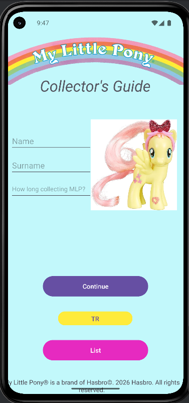
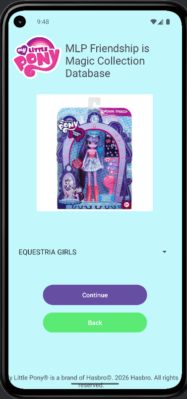
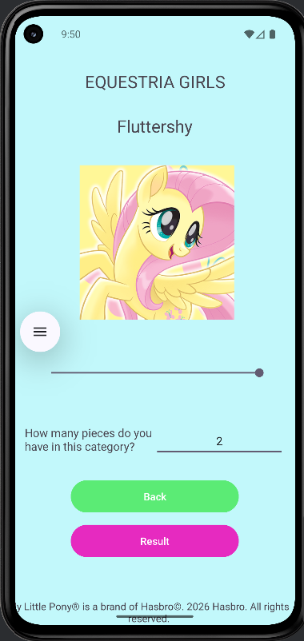
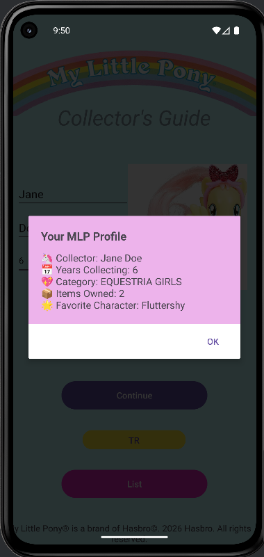
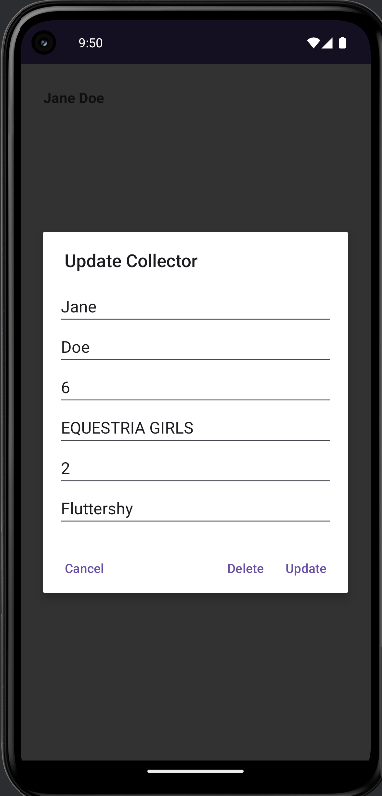

# My Little Pony Collector Guide

**Created by: Elifnur Ozcelik**

## Description
My Little Pony Collector Guide is an Android application designed for My Little Pony collectors to create and manage a simple collection profile. Users can enter their collector information, select a My Little Pony collection category, choose a favorite character, and record the number of items they own.

The application guides users through multiple screens to create a personalized collector profile. Saved information can be updated or deleted through the profile management interface.

The project was developed using Kotlin and Android Studio as part of an academic mobile application development assignment. It focuses on user interface design, activity navigation, data transfer between screens, and interactive Android components.

## Key Features
🦄 Collector profile – Create a profile with basic collector information, including collection category, favorite character, and number of items owned.

📋 Profile management – View, update, and delete saved collector information.

🧭 Multi-screen navigation – Navigate between the collector profile, category, and character selection screens.

## Technologies Used
- Kotlin
- Android Studio
- Android SDK
- XML Layouts
- Material Components for Android
- View Binding
- RecyclerView
- Intents

## Application Flow
🏠 **Home Screen** → Enter collector information.

📂 **Category Selection** → Choose a collection category.

🦄 **Character Selection** → Select a favorite character and specify the number of collected items.

💖 **Collector Profile** → View the completed collector profile.

✏️ **Profile Management** → Update or delete the saved profile.

## Screenshots  

Here are some screenshots of the project:

  
*Collector information entry screen.*

  
*Collection category selection.*

  
*Favorite character and item count selection.*

  
*Completed collector profile summary.*

  
*Profile update and deletion options.*

## License  

See the [LICENSE](LICENSE) file for copyright and usage information.

## Last Updated  

August 2026
